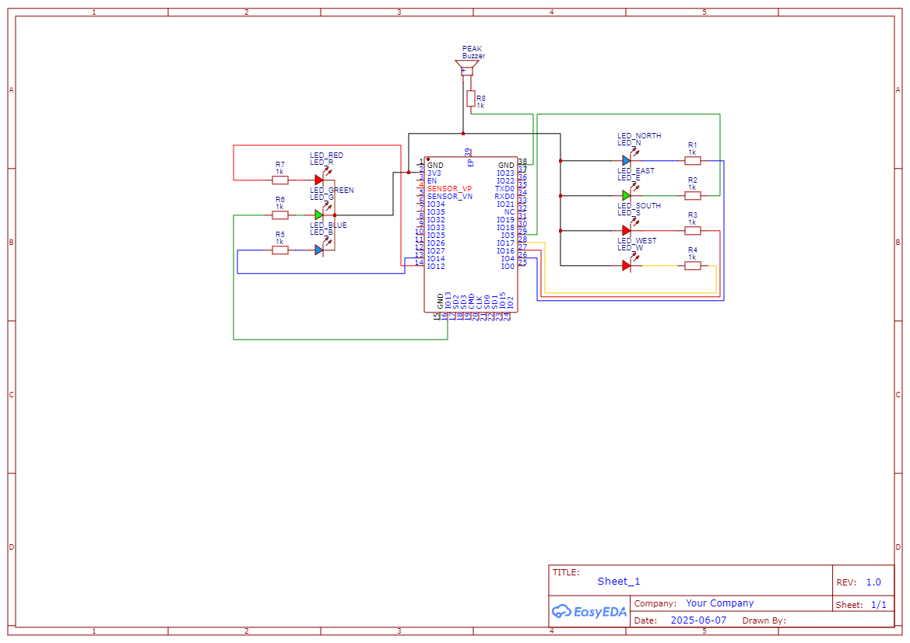

# DND_Compass_Puzzle

### Command list

## RGB Commands

# RGB LED

| Command       | Description            |
| ------------- | ---------------------- |
| `RGB_PA`      | Set color to Aether    |
| `RGB_PL`      | Set color to Lucian    |
| `RGB_PJ`      | Set color to Jiji      |
| `RGB_PT`      | Set color to Taron     |
| `RGB_PS`      | Set color to Seraphine |
| `RGB_RED`     | Set color to Red       |
| `RGB_BLUE`    | Set color to Blue      |
| `RGB_CGREEN`  | Set color to Green     |
| `RGB_YELLOW`  | Set color to Yellow    |
| `RGB_MAGENTA` | Set color to Magenta   |
| `RGB_CYAN`    | Set color to Cyan      |
| `RGB_WHITE`   | Set color to White     |
| `RGB_OFF`     | Set color to Off       |

# RGB pulse LED

| Command         | Description                             |
| --------------- | --------------------------------------- |
| `P_RGB_PA`      | Pulse Aether color (default: 1x, 200ms) |
| `P_RGB_PL`      | Pulse Lucian                            |
| `P_RGB_PJ`      | Pulse Jiji                              |
| `P_RGB_PT`      | Pulse Taron                             |
| `P_RGB_PS`      | Pulse Seraphine                         |
| `P_RGB_RED`     | Pulse Red                               |
| `P_RGB_BLUE`    | Pulse Blue                              |
| `P_RGB_CGREEN`  | Pulse Green                             |
| `P_RGB_YELLOW`  | Pulse Yellow                            |
| `P_RGB_MAGENTA` | Pulse Magenta                           |
| `P_RGB_CYAN`    | Pulse Cyan                              |
| `P_RGB_WHITE`   | Pulse White                             |

## Compass Comands

# Compass Directions

| Command       | Description               |
| ------------- | ------------------------- |
| `COMPASS_N`   | Light up North            |
| `COMPASS_E`   | Light up East             |
| `COMPASS_S`   | Light up South            |
| `COMPASS_W`   | Light up West             |
| `COMPASS_NE`  | North + East (diagonal)   |
| `COMPASS_NW`  | North + West              |
| `COMPASS_SE`  | South + East              |
| `COMPASS_SW`  | South + West              |
| `COMPASS_ALL` | Turn on all directions    |
| `COMPASS_OFF` | Turn off all compass LEDs |

# Compass Directions Pulsing

| Command         | Description                      |
| --------------- | -------------------------------- |
| `P_COMPASS_N`   | Pulse North (default: 1x, 200ms) |
| `P_COMPASS_E`   | Pulse East                       |
| `P_COMPASS_S`   | Pulse South                      |
| `P_COMPASS_W`   | Pulse West                       |
| `P_COMPASS_NE`  | Pulse North + East               |
| `P_COMPASS_NW`  | Pulse North + West               |
| `P_COMPASS_SE`  | Pulse South + East               |
| `P_COMPASS_SW`  | Pulse South + West               |
| `P_COMPASS_ALL` | Pulse all directions             |

## Usage

You can call:

```
P_COMPASS_N 3 150
```

In the serial monitor to pulse North 3 times at 150ms delay.

### Electrical diagram


